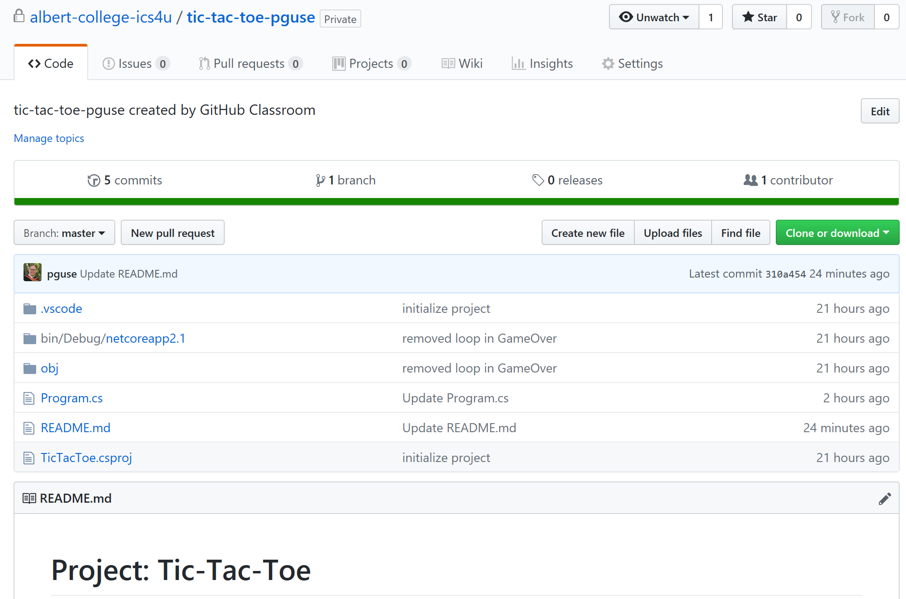
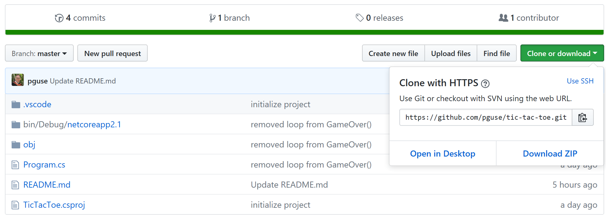
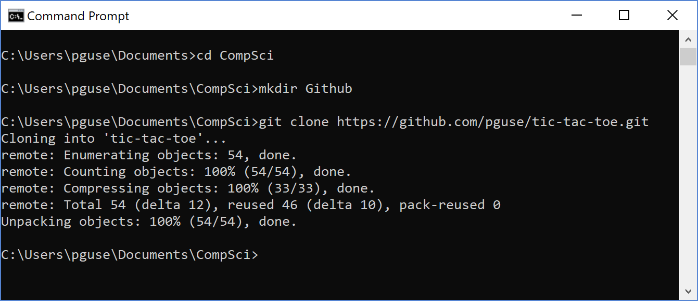
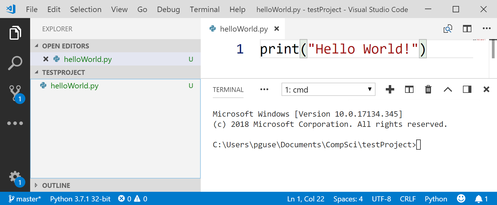
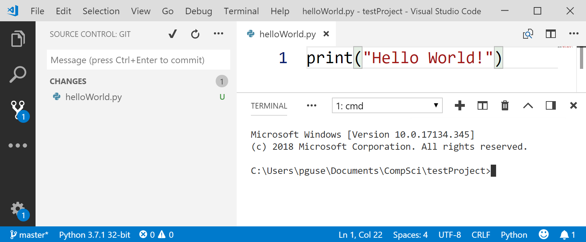
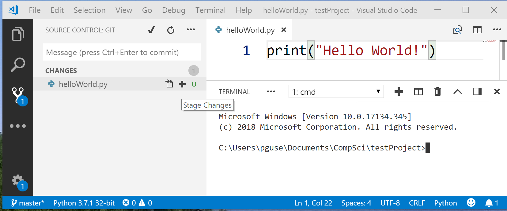
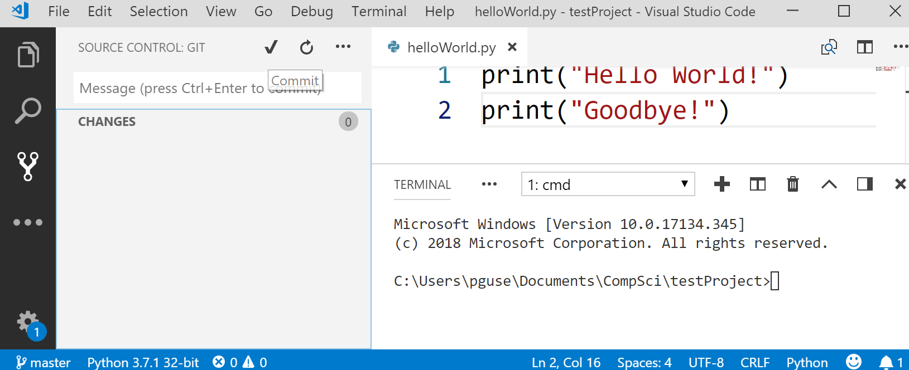
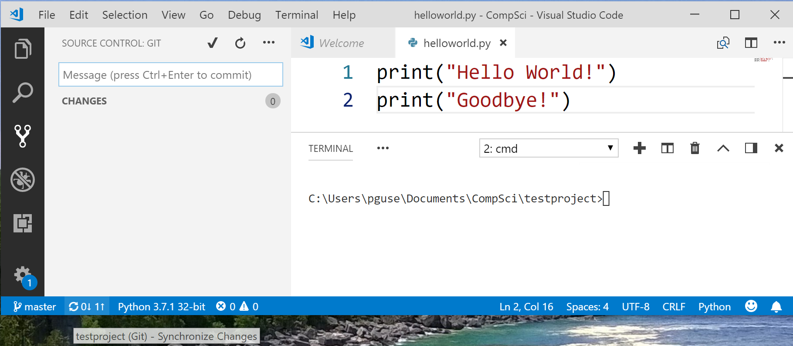

# Setting up Github

1. Install **Git** for [Windows](https://git-scm.com/download/win) or [Mac](https://git-scm.com/download/mac).  **Git** is a version control system that allows you maintain a history of every version of a file/project as well as collaborate among various team members.
2. Go to **github.com** and create an account with a username/email that is the same as your Albert College email address.  For example, my account would be ***pguse@albertcollegess.com*** .
3. When given a link to an assignment, click the link and then **Accept the Assignment**.  If you are already logged into your Github account you should now see your Tic-Tac-Toe project repository.  It should look something like this.

In order to move the repository onto your own computer, you should go through the next set of steps.

4. Click on the **green button**, in the upper right corner of the current window, labelled **Clone or download**.

5. Copy the link that appears by clicking the copy icon 

6. Now open a **terminal/command prompt**.  Navigate to the folder where you are storing all of your computer science work.  You might need to use the **cd** command to move between folders ***(or just open the folder using Visual Studio Code)*** .  Once you get to the correct folder, make a ***new folder*** called **Github**.  In the terminal you do this using the **mkdir** command. Now that you are in the **Github** folder, type ***git clone 'paste the address that you copied in step 5 here'*** .  The sequence of commands might look like the following ***(with a different copied address)*** . 

**IMPORTANT:**  The first time you clone a repository, you will be asked to enter your Github username and password.  When you enter your password, you'll notice that the cursor does not move.  This is a security feature.  Just type in your password properly and press ***Enter*** and everything should work fine.

# Using Git with Visual Studio Code

When working with a file in **Visual Studio Code**, you normally are using the **Explorer tab** ***(it looks like two pieces of paper)*** .  Here is a simple "Hello World" Python program, with the **Explorer tab** selected.

When working with a GitHub repository, in order to update any changes that you make, you must first select the **Source Control tab** ***(it looks like a fork in the road)*** .  Here is the new view of our Python program.

## Stage Changes (Add)

Now click on the plus sign (+) beside the file name in order to stage the changes that you have made to your file.

You may notice that the 'U' beside the filename has been replaced by an 'A' because your file has been added to your repository.

## Commit

In order to commit your changes to your repository, type a message in the message box that concisely describes the changes you made to the file.  Now click the check mark.

## Push/Pull - Synchronize Changes

Now, the final step is to refresh your Github repository by clicking on the **'arrow circle'** on the **bottom-left corner** of the window.  This will synchronize the changes made to your repository, so that your local files and your repository on Github are the same.

